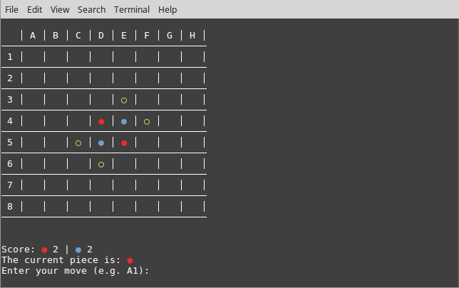

# reversi

A haskell implementation of the game Reversi.

Windows support is untested and not guaranteed.



## Usage

Standard stack commands apply.

### Build

```
stack build
```

### Run Game

```
stack exec reversi
```

### Interactive mode
This automatically adds the Reversi module and all of its bindings into scope.
Great for development.

```
stack ghci
```

